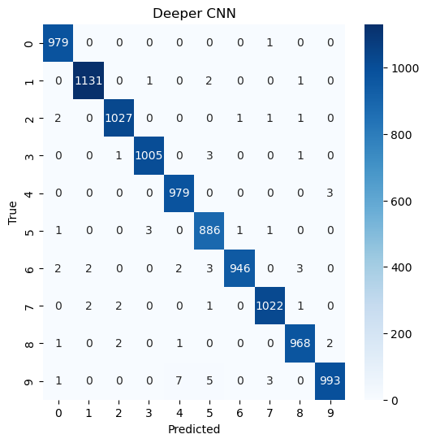
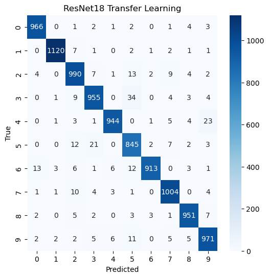

# MNIST Classification: CNN Architecture, Optimizer, and Transfer Learning Study


A PyTorch-based deep-learning experiment comparing custom CNN architectures,
optimizer choices, model capacity, and transfer learning on the MNIST dataset.

<div align="center">


</div>

This repository documents one of my first end-to-end deep learning experiments. I built a baseline convolutional neural network for handwritten digit classification, changed one design choice at a time, and compared the results with a pretrained ResNet-18 transfer-learning model.

The purpose of the project was not only to obtain high accuracy, but also to understand how **network width, network depth, optimizer choice, parameter count, and transfer learning** affect model performance and efficiency.

## Table of Contents

- [Project Overview](#project-overview)
- [Dataset and Preprocessing](#dataset-and-preprocessing)
- [Experiments](#experiments)
- [Evaluation Method](#evaluation-method)
- [Results](#results)
- [Key Findings](#key-findings)
- [Repository Contents](#repository-contents)
- [Installation](#installation)
- [Running the Experiments](#running-the-experiments)
- [Saved Experiment Data](#saved-experiment-data)
- [Limitations and Planned Improvements](#limitations-and-planned-improvements)

## Project Overview

The project compares five PyTorch models trained on the MNIST handwritten-digit dataset:

1. **Baseline CNN** — a compact two-layer convolutional network.
2. **More Filters CNN** — a wider version of the baseline with more convolutional filters.
3. **Deeper CNN** — a deeper custom network with a third convolutional layer and an additional pooling operation.
4. **Adam Optimizer CNN** — the baseline architecture trained with Adam instead of Adadelta.
5. **ResNet-18 Transfer Learning** — an ImageNet-pretrained ResNet-18 with a frozen feature extractor and a new classification layer.

The experiments were designed as controlled comparisons. Each custom model changed one main factor while keeping the other training settings as consistent as possible.

### Questions explored

- Does increasing the number of filters improve MNIST classification?
- Is adding depth more effective than simply making the network wider?
- Does Adam outperform Adadelta for the baseline architecture?
- Can a frozen ImageNet-pretrained ResNet-18 outperform a task-specific CNN on MNIST?
- Which model provides the best balance between accuracy and parameter efficiency?

## Dataset and Preprocessing

The experiments use the standard **MNIST** dataset provided through `torchvision.datasets.MNIST`.

- **Training set:** 60,000 grayscale images
- **Test set:** 10,000 grayscale images
- **Classes:** digits 0 through 9
- **Original image size:** 28 × 28 pixels

The dataset is downloaded automatically when an experiment notebook is executed.

### Custom CNN preprocessing

The four custom CNN experiments use the same transformation:

```python
transforms.Compose([
    transforms.ToTensor(),
    transforms.Normalize((0.1307,), (0.3081,))
])
```

The images remain single-channel 28 × 28 tensors.

### ResNet-18 preprocessing

ResNet-18 was pretrained on ImageNet and expects larger three-channel inputs. MNIST images were therefore:

- Resized from 28 × 28 to 224 × 224
- Converted from one grayscale channel to three identical channels
- Normalized with the preprocessing statistics supplied by the pretrained ResNet-18 weights

```python
transforms.Compose([
    transforms.Resize((224, 224)),
    transforms.Grayscale(num_output_channels=3),
    transforms.ToTensor(),
    transforms.Normalize(
        mean=weights.transforms().mean,
        std=weights.transforms().std
    )
])
```

## Experiments

All models were trained for **12 epochs** with a **batch size of 128**. CUDA was used automatically when available; otherwise, training ran on the CPU.

| Experiment | Main design | Optimizer | Learning rate | Total parameters |
|---|---|---:|---:|---:|
| Baseline CNN | Convolution channels 32 → 64 | Adadelta | 1.0 | 1,199,882 |
| More Filters CNN | Convolution channels 64 → 128 | Adadelta | 1.0 | 2,435,210 |
| Deeper CNN | Convolution channels 32 → 64 → 64 with two pooling stages | Adadelta | 1.0 | 261,962 |
| Adam Optimizer CNN | Same architecture as the baseline | Adam | 0.001 | 1,199,882 |
| ResNet-18 Transfer Learning | Frozen pretrained backbone with a new 512 → 10 classifier | Adam | 0.001 | 11,181,642 |

Only the final fully connected layer of ResNet-18 was optimized. This layer contains **5,130 trainable parameters**, although the complete network contains more than 11 million parameters.

### Baseline CNN

```text
Input: 1 × 28 × 28
Conv2d: 1 → 32, kernel size 3
ReLU
Conv2d: 32 → 64, kernel size 3
ReLU
Max pooling
Dropout2d: 0.25
Flatten: 9,216 features
Linear: 9,216 → 128
ReLU
Dropout: 0.50
Linear: 128 → 10
LogSoftmax
```

### More Filters CNN

This experiment keeps the baseline structure but increases the convolutional width:

```text
Conv2d: 1 → 64
Conv2d: 64 → 128
```

The change approximately doubles the number of parameters.

### Deeper CNN

This experiment adds a third convolutional layer and a second pooling stage:

```text
Conv2d: 1 → 32
Conv2d: 32 → 64
Max pooling
Conv2d: 64 → 64
Max pooling
Dropout2d
Flatten: 1,600 features
Linear: 1,600 → 128
Dropout
Linear: 128 → 10
```

Although this model is deeper, the second pooling operation reduces the flattened representation from 9,216 to 1,600 features. As a result, it has far fewer parameters than the baseline.

### Adam Optimizer CNN

This experiment uses the exact baseline architecture while replacing Adadelta with Adam. It isolates the effect of the optimizer without changing the network structure.

### ResNet-18 Transfer Learning

The ResNet experiment loads pretrained ImageNet weights, freezes the existing network parameters, and replaces the original classification layer with:

```python
nn.Linear(512, 10)
```

This evaluates whether generic pretrained visual features transfer effectively to small grayscale handwritten digits.

## Evaluation Method

Each model was evaluated after every epoch. The stored experiment artifacts include:

- Training loss
- Test loss
- Test accuracy
- Weighted precision
- Weighted recall
- Weighted F1 score
- Classification report
- Confusion matrix
- Model architecture
- Hyperparameters
- Parameter count

The main comparison uses the final epoch results. The best observed test accuracy across the 12-epoch history is also reported to show each model's highest recorded performance.

## Results

| Model | Final accuracy | Weighted F1 | Best observed accuracy | Best epoch | Test errors | Total parameters |
|---|---:|---:|---:|---:|---:|---:|
| **Deeper CNN** | **99.36%** | **99.36%** | **99.53%** | 11 | **64** | **261,962** |
| More Filters CNN | 99.17% | 99.17% | 99.25% | 11 | 83 | 2,435,210 |
| Adam Optimizer CNN | 99.10% | 99.10% | 99.27% | 9 | 90 | 1,199,882 |
| Baseline CNN | 99.09% | 99.09% | 99.09% | 12 | 91 | 1,199,882 |
| ResNet-18 Transfer Learning | 96.59% | 96.60% | 96.87% | 11 | 341 | 11,181,642 |

The complete precision, recall, F1, optimizer, epoch, batch-size, parameter, and recorded timing values are available in [`comparison_results.csv`](comparison_results.csv).

### Accuracy comparison


### Accuracy across epochs


### Training and test loss

<table>
  <tr>
    <td width="50%">
      
    </td>
    <td width="50%">
      
    </td>
  </tr>
</table>

### Parameter comparison


### Confusion-matrix comparison

The Deeper CNN produced the cleanest confusion matrix, while the frozen ResNet-18 made substantially more errors between visually similar digits.

<table>
  <tr>
    <th>Deeper CNN</th>
    <th>ResNet-18 Transfer Learning</th>
  </tr>
  <tr>
    <td width="50%">
      
    </td>
    <td width="50%">
      
    </td>
  </tr>
</table>

Notable Deeper CNN errors included digit **9** being classified as **4** or **5**. ResNet-18 showed broader confusion, particularly between **3 and 5**, **4 and 9**, and **5 and 3**.

## Key Findings

### 1. Increasing depth was more effective than increasing width

The Deeper CNN achieved the highest final accuracy and weighted F1 score while using the fewest parameters. Its additional convolution and pooling stage improved feature extraction and greatly reduced the size of the fully connected layer.

### 2. More filters produced only a small improvement

The More Filters CNN increased the parameter count from approximately 1.20 million to 2.44 million, but final accuracy improved by only 0.08 percentage points over the baseline.

This experiment showed that a larger model is not automatically a more efficient model.

### 3. Adam and Adadelta produced almost identical final accuracy

The Adam CNN finished at 99.10%, compared with 99.09% for the Adadelta baseline. Because the architectures were identical, the result suggests that optimizer choice had only a small effect on final performance in this single run.

Adam reached its best result earlier, recording 99.27% at epoch 9.

### 4. Transfer learning was not the best approach for this task

The frozen ResNet-18 achieved 96.59% final accuracy, below all four custom CNNs. It also required 224 × 224 three-channel inputs and a forward pass through an 11-million-parameter network.

In this setup, a compact network designed specifically for MNIST was more accurate and more efficient than a frozen ImageNet feature extractor.

### 5. Confusion matrices revealed information hidden by accuracy

The custom CNNs all achieved approximately 99% accuracy, but they did not make exactly the same mistakes. Examining class-level errors made it possible to identify recurring ambiguities such as:

- 2 and 7
- 4 and 9
- 3 and 5
- 5 and 3

This reinforced the importance of using confusion matrices and class-level metrics instead of relying only on overall accuracy.

## Repository Contents

### Training notebooks

| File | Purpose |
|---|---|
| `Loading_MNIST_data&Building_the_model.ipynb` | Loads MNIST, defines the baseline CNN, trains it, evaluates it, and saves the experiment data |
| `Different_filter_number.ipynb` | Tests the effect of increasing convolutional filters |
| `deeperCNN.ipynb` | Tests a deeper CNN with a third convolutional layer and a second pooling stage |
| `Different_optimizer_algo.ipynb` | Trains the baseline architecture with Adam |
| `resnet_ft-tl.ipynb` | Applies frozen ResNet-18 transfer learning to MNIST |
| `comparison.ipynb` | Loads all saved experiments, creates the comparison table, and generates the combined figures |

### Experiment artifacts

| File | Contents |
|---|---|
| `baseline_cnn_experiment.pkl` | Baseline metrics, histories, classification report, confusion matrix, and configuration |
| `more_filters_cnn_experiment.pkl` | More Filters CNN experiment data |
| `deeper_cnn_experiment.pkl` | Deeper CNN experiment data |
| `adam_optimizer_cnn_experiment.pkl` | Adam CNN experiment data |
| `resnet18_experiment.pkl` | ResNet-18 experiment data |
| `comparison_results.csv` | Final tabular comparison of all five experiments |

The repository also contains individual accuracy plots, loss plots, confusion matrices, and combined comparison figures.

## Installation

The notebook metadata records **Python 3.13.9**.

Create and activate a virtual environment:

```bash
python -m venv .venv
```

Windows:

```bash
.venv\Scripts\activate
```

macOS or Linux:

```bash
source .venv/bin/activate
```

Install the required libraries:

```bash
pip install torch torchvision torchaudio
pip install numpy pandas matplotlib seaborn scikit-learn joblib jupyter
```

Start Jupyter Notebook:

```bash
jupyter notebook
```

## Running the Experiments

Run the notebooks in the following order:

```text
1. Loading_MNIST_data&Building_the_model.ipynb
2. Different_filter_number.ipynb
3. deeperCNN.ipynb
4. Different_optimizer_algo.ipynb
5. resnet_ft-tl.ipynb
6. comparison.ipynb
```

Each training notebook:

1. Downloads and preprocesses MNIST.
2. Creates the model.
3. Trains for 12 epochs.
4. Evaluates the model after each epoch.
5. Generates loss, accuracy, and confusion-matrix outputs.
6. Saves the experiment dictionary and model state dictionary.

Before running `comparison.ipynb`, confirm that the five `.pkl` files are stored at the locations used in its first code cell. Update those paths when your local folder structure is different.

## Saved Experiment Data

Each `.pkl` experiment file stores a dictionary with information similar to:

```python
{
    "name": ...,
    "optimizer": ...,
    "batch_size": ...,
    "epochs": ...,
    "parameter_count": ...,
    "history": {
        "train_loss": [...],
        "test_loss": [...],
        "test_accuracy": [...]
    },
    "accuracy": ...,
    "precision": ...,
    "recall": ...,
    "f1": ...,
    "classification_report": ...,
    "confusion_matrix": ...,
    "architecture": ...,
    "learning_rate": ...
}
```

This makes it possible to compare experiments without retraining every model.

## Limitations and Planned Improvements

This project represents an early experimental study rather than a definitive benchmark. The current results come from one training run per configuration.

Planned improvements include:

- Setting and documenting random seeds
- Repeating experiments and reporting mean performance with variability
- Creating a validation split for model and epoch selection
- Saving the best validation checkpoint instead of only the final model
- Measuring complete training time rather than storing only the final-epoch duration
- Standardizing file names and experiment paths
- Adding data augmentation and learning-rate experiments
- Testing partial and full ResNet fine-tuning
- Adding an inference script or small demonstration application

## Final Conclusion

The main result of this study is that **careful architectural design mattered more than simply increasing model size**.

The Deeper CNN reached **99.36% final test accuracy**, made only **64 errors on 10,000 test images**, and used **261,962 parameters**. It outperformed the wider CNN, the optimizer variation, and the much larger frozen ResNet-18 model.

For this MNIST experiment, a compact task-specific CNN provided the strongest combination of **accuracy, efficiency, and interpretability**.

## Author

**Daniel HK**  
Computer Science Engineering Student | Data Science and Machine Learning

---

<div align="center">

If this project helped you, consider giving the repository a ⭐.

</div>
